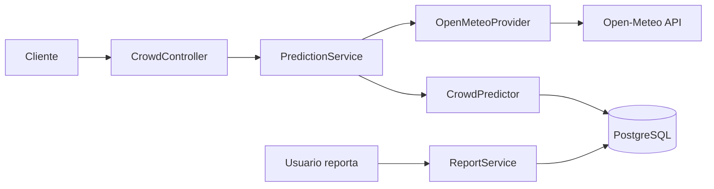
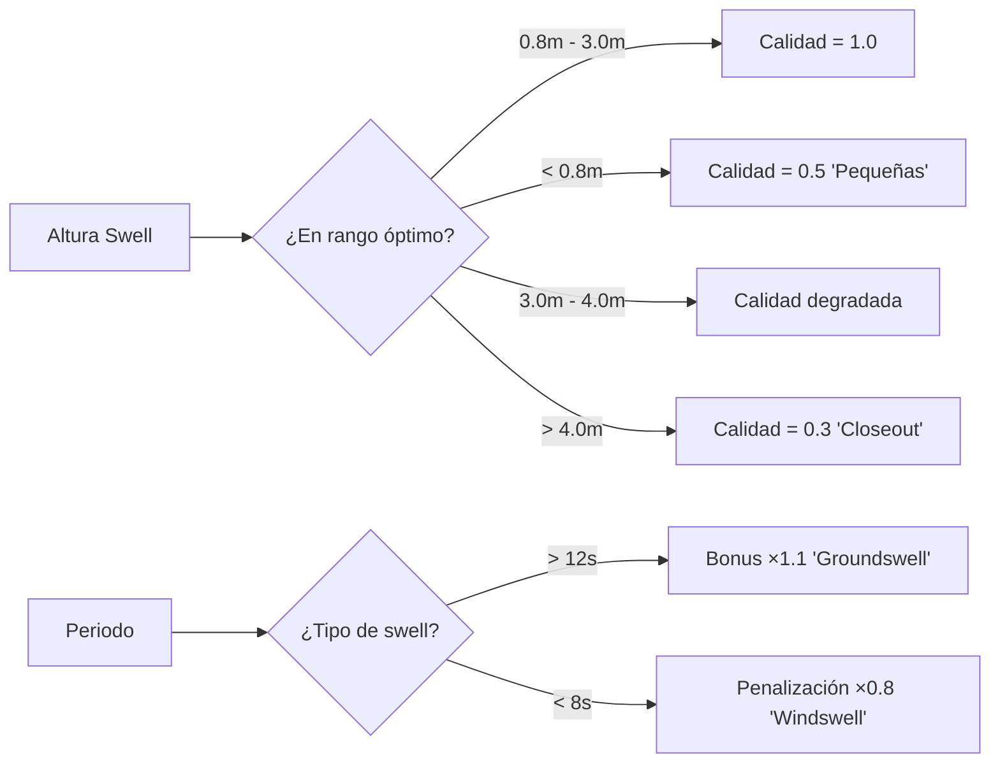
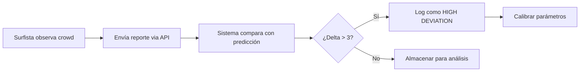

# CrowdSurf API - Manual de Administrador 🌊

> **Versión:** 1.0.0  
> **Última actualización:** 2026-02-09

---

## 📋 Tabla de Contenidos

1. [Introducción y Propósito](#1-introducción-y-propósito)
2. [Arquitectura de la Aplicación](#2-arquitectura-de-la-aplicación)
3. [Endpoints de la API](#3-endpoints-de-la-api)
4. [Modelo Heurístico de Predicción](#4-modelo-heurístico-de-predicción)
5. [Configuración de Parámetros](#5-configuración-de-parámetros)
6. [Gestión de Spots](#6-gestión-de-spots)
7. [Sistema de Reportes (Ground Truth Loop)](#7-sistema-de-reportes-ground-truth-loop)
8. [Mantenimiento y Operaciones](#8-mantenimiento-y-operaciones)

---

## 1. Introducción y Propósito

### ¿Qué es CrowdSurf API?

CrowdSurf es una **API de predicción de afluencia (crowd)** en spots de surf. Su objetivo principal es estimar y predecir cuánta gente habrá en el agua en un spot de surf concreto a una hora determinada.

### ¿Por qué existe esta API?

El problema que resuelve es claro: los surfistas quieren saber **dónde y cuándo surfear con menos gente**. Esta API proporciona:

| Funcionalidad | Descripción |
|--------------|-------------|
| **Nivel de crowd** | Escala 0-10 con categorías descriptivas |
| **Predicción horaria** | Forecast hasta 72 horas |
| **Confianza de predicción** | Nivel de certeza de cada estimación |
| **Factores explicativos** | Por qué se espera ese nivel de crowd |

### Principio Fundamental

> **No existen datos directos del número real de surfistas en la mayoría de spots.**  
> La predicción se basa en un **modelo heurístico** que combina condiciones meteorológicas con patrones temporales y características del spot.

---

## 2. Arquitectura de la Aplicación

### Estructura de Carpetas

```
CrowdSurf/
├── src/main/java/com/crowdsurf/
│   ├── config/         → HeuristicConfig.java (parámetros del modelo)
│   ├── domain/         → Entidades JPA (Spot, CrowdPrediction, CrowdReport, Forecast)
│   ├── engine/         → CrowdPredictor.java (motor de predicción)
│   ├── provider/       → OpenMeteoProvider.java (datos meteorológicos)
│   ├── repository/     → Repositorios JPA
│   ├── service/        → Lógica de negocio
│   └── web/            → Controllers y DTOs
├── src/main/resources/
│   ├── application.properties  → Configuración
│   └── spots.csv               → Catálogo de spots
└── docker-compose.yml
```

### Flujo de Datos



### Componentes Clave

| Componente | Archivo | Responsabilidad |
|-----------|---------|-----------------|
| **Controller** | `CrowdController.java` | Expone endpoints REST |
| **Predictor** | `CrowdPredictor.java` | Motor heurístico de cálculo |
| **Weather Provider** | `OpenMeteoProvider.java` | Obtiene datos de Open-Meteo |
| **Config** | `HeuristicConfig.java` | Parámetros ajustables del modelo |
| **Spot Service** | `SpotService.java` | Carga y gestión de spots |
| **Report Service** | `ReportService.java` | Ground truth loop |

---

## 3. Endpoints de la API

### 3.1 Listar Spots

```http
GET /api/v1/spots
```

**Propósito:** Retorna la lista completa de spots de surf disponibles en el sistema.

**Respuesta de ejemplo:**
```json
[
  {
    "id": 1,
    "name": "Mundaka",
    "latitude": 43.407,
    "longitude": -2.698,
    "basePopularity": 8.0,
    "skillLevel": "EXPERT",
    "optimalTideState": "LOW",
    "timezone": "Europe/Madrid"
  }
]
```

**Uso típico:** Listar spots para que el usuario seleccione uno para ver su predicción.

---

### 3.2 Obtener Predicción de Crowd

```http
GET /api/v1/spots/{id}/prediction?hours=48
```

**Propósito:** Retorna la predicción actual y el forecast para las próximas horas.

**Parámetros:**
| Parámetro | Tipo | Descripción | Rango |
|-----------|------|-------------|-------|
| `id` | Path | ID del spot | Long |
| `hours` | Query | Horas de forecast | 1-72 (default: 48) |

**Respuesta de ejemplo:**
```json
{
  "spot": {
    "id": 3,
    "name": "Mundaka",
    "latitude": 43.407,
    "longitude": -2.698,
    "basePopularity": 8.0
  },
  "current": {
    "time": "2026-02-09T12:00:00",
    "crowdLevel": 6,
    "crowdCategory": "MEDIUM",
    "confidence": 0.85,
    "conditionQuality": 0.75,
    "tideHeight": 1.2,
    "tideState": "RISING",
    "primaryFactors": "Fin de semana, Olas óptimas, Offshore"
  },
  "forecast": [
    {
      "time": "2026-02-09T13:00:00",
      "crowdLevel": 7,
      "crowdCategory": "HIGH",
      "confidence": 0.80,
      "primaryFactors": "Fin de semana, Pico mediodía"
    }
  ]
}
```

**Campos importantes de la respuesta:**

| Campo | Descripción |
|-------|-------------|
| `crowdLevel` | Nivel 0-10 (0 = vacío, 10 = saturado) |
| `crowdCategory` | Categoría textual: EMPTY, LOW, MEDIUM, HIGH, SATURATED |
| `confidence` | Confianza de la predicción (0.0-1.0) |
| `conditionQuality` | Calidad de condiciones de surf (0.0-1.0) |
| `primaryFactors` | Factores que explican la predicción |

---

### 3.3 Enviar Reporte de Crowd

```http
POST /api/v1/reports
```

**Propósito:** Permite a usuarios reportar el crowd observado en tiempo real. Estos reportes alimentan el "ground truth loop" para calibrar el modelo.

**Body de ejemplo:**
```json
{
  "spotId": 3,
  "crowdLevel": 7,
  "reporterId": "user123",
  "notes": "Solo estaba yo y otros 5 locales"
}
```

**Parámetros:**
| Campo | Tipo | Requerido | Descripción |
|-------|------|-----------|-------------|
| `spotId` | Long | ✅ | ID del spot |
| `crowdLevel` | Integer | ✅ | Nivel observado (0-10) |
| `reporterId` | String | ❌ | Identificador del usuario |
| `notes` | String | ❌ | Observaciones adicionales |

**Respuesta:**
```json
{
  "reportId": 123
}
```

---

### 3.4 Obtener Reportes Recientes

```http
GET /api/v1/reports/recent
```

**Propósito:** Retorna los 50 reportes más recientes de todos los spots.

**Uso:** Útil para dashboards administrativos y análisis de desviaciones entre predicción y realidad.

---

### 3.5 Health Check

```http
GET /api/v1/health
```

**Propósito:** Verificar el estado de la API.

**Respuesta:**
```json
{
  "status": "UP",
  "version": "1.0.0",
  "spots": 50
}
```

---

## 4. Modelo Heurístico de Predicción

### 4.1 Fórmula General

El motor de predicción calcula el crowd usando la siguiente fórmula:

```
Score = BasePopularity × StokeMultiplier × FactoresTemporales × FactoresClima
```

El **Score** resultante se **normaliza a escala 0-10** y se categoriza.

### 4.2 Escala de Crowd

| Rango | Categoría | Descripción |
|-------|-----------|-------------|
| 0-2 | `EMPTY` | Vacío - prácticamente nadie |
| 2-4 | `LOW` | Bajo - pocas personas |
| 4-7 | `MEDIUM` | Normal - afluencia moderada |
| 7-9 | `HIGH` | Alto - crowded |
| 9-10 | `SATURATED` | Saturado - exceso de gente |

### 4.3 Los 5 Factores del Modelo

#### Factor 1: Temporal 📅

Evalúa **cuándo** es más probable que haya gente.

| Condición | Efecto | Parámetro |
|-----------|--------|-----------|
| Fin de semana / Festivo | ×1.4 | `weekendMultiplier` |
| Horario laboral (9-17h) | ×0.6 | `workHoursPenalty` |
| After-work (18-20h) | ×1.2 | `afterWorkMultiplier` |
| Dawn patrol (6-8h) | ×0.95 | `dawnPatrolMultiplier` |
| Temporada alta (Jun-Sep) | ×1.30 | `highSeasonMultiplier` |
| Temporada baja (Dic-Feb) | ×0.70 | `lowSeasonMultiplier` |

**Lógica:** Los fines de semana hay más gente porque no trabajan. En horario laboral hay menos gente. En verano hay más turistas.

---

#### Factor 2: Calidad de Olas 🌊

Evalúa si las olas atraerán surfistas.



| Condición | Calidad | Factor |
|-----------|---------|--------|
| Olas óptimas (0.8m - 3.0m) | 1.0 | `allLevelsSwellMin/Max` |
| Olas muy pequeñas (< 0.8m) | 0.5 | `tooSmallWaveQuality` |
| Olas excesivas (> 4.0m) | 0.3 | `closeoutWaveQuality` |
| Groundswell (periodo > 12s) | ×1.1 | `longPeriodBonus` |
| Windswell (periodo < 8s) | ×0.8 | `shortPeriodPenalty` |

**Lógica:** Cuando las olas son buenas (tamaño óptimo + groundswell), más gente sale a surfear. Olas muy pequeñas o closeouts alejan surfistas.

---

#### Factor 3: Viento 💨

Evalúa si el viento favorece o arruina las condiciones.

| Condición | Score | Parámetro |
|-----------|-------|-----------|
| Glassy (< 6 km/h) | 1.0 | `lightWindThreshold` |
| Offshore (viento de tierra) | 1.0 × degradación | `offshoreAngleThreshold` |
| Sideshore (lateral) | 0.6 | `sideshoreScore` |
| Onshore (viento de mar) | 0.5 × degradación | `onshoreAngleThreshold` |
| Viento fuerte (> 30 km/h) | 0.1 | `strongWindThreshold` |

**Cómo se determina offshore/onshore:**
1. Cada spot tiene una `optimalWindDirection` (dirección del viento que sopla de tierra al mar)
2. Se calcula la diferencia angular entre el viento actual y la dirección óptima
3. Si la diferencia es ≤ 45° → **Offshore** (perfecto)
4. Si la diferencia es ≥ 135° → **Onshore** (malo)
5. Intermedio → **Sideshore** (aceptable)

---

#### Factor 4: Marea 🌊

Evalúa si la marea actual coincide con la preferencia del spot.

| Spot prefiere | Marea actual | Multiplicador |
|---------------|--------------|---------------|
| LOW | LOW | ×1.1 (perfecta) |
| LOW | HIGH | ×0.9 (mala) |
| LOW | MID | ×0.95 |
| ANY | Cualquiera | ×1.0 |

**Sensibilidad del spot:** Cada spot tiene un parámetro `tideSensitivity` (0.0-1.0) que modula cuánto afecta la marea:
- **Mundaka**: tideSensitivity = 1.0 (solo funciona en marea baja)
- **Beach break genérico**: tideSensitivity = 0.2 (funciona con cualquier marea)

La penalización real = penalización × sensibilidad.

---

#### Factor 5: Clima ☀️

Evalúa si las condiciones climáticas alejan surfistas.

| Condición | Multiplicador | Parámetro |
|-----------|---------------|-----------|
| Lluvia | ×0.85 | `rainPenalty` |
| Frío (< 10°C) | ×0.85 | `coldWaterPenalty` |
| Calor (> 25°C) | ×1.05 | `warmWaterBonus` |

**Lógica:** La lluvia y el frío disuaden a surfistas ocasionales, pero no tanto a locales comprometidos.

---

### 4.4 El Multiplicador Stoke (Sigmoid)

El **StokeMultiplier** es una función sigmoid que modela cómo la calidad de condiciones atrae gente:

```
StokeMultiplier = 0.5 + (sigmoid(effectiveQuality) × (maxSaturation - 0.5))
```

Donde:
- `effectiveQuality = (waveQuality × 0.75) + (windQuality × 0.20)`
- La sigmoid tiene midpoint = 7.0 y steepness = 0.8

```
   StokeMultiplier
        ↑
   1.6 ─┼─────────────────────────*****
       │                    ****
   1.0 ─┼────────────────****
       │              ***
   0.5 ─┼─────────****
       │    ****
       └────────────────────────→ Calidad de condiciones
         0    3    6    7    10
```

**Interpretación:** Cuando las condiciones son mediocres (calidad < 5), el multiplicador es bajo (~0.6-0.8). Cuando las condiciones son excelentes (calidad > 8), el multiplicador satura (~1.5-1.6).

---

### 4.5 Modo Nocturno 🌙

**Regla especial:** Durante la noche (desde 1h después del atardecer hasta el amanecer), el crowd es automáticamente **0**.

```java
if (!isDaylight(forecast)) {
    return buildNightPrediction(spot, forecast); // crowdLevel = 0
}
```

Esta es una simplificación razonable porque prácticamente nadie surfea de noche.

---

### 4.6 Cálculo de Confianza

La confianza de la predicción **decae con el tiempo**:

| Horizonte | Confianza |
|-----------|-----------|
| Ahora (0h) | 0.85 |
| +12h | 0.80 |
| +24h | 0.70 |
| +48h | 0.55 |
| +72h | 0.40 |

**Por qué:** Los pronósticos meteorológicos son menos precisos a mayor plazo. Esto se refleja en la confianza de la predicción de crowd.

---

## 5. Configuración de Parámetros

### 5.1 Archivo de Configuración

Todos los parámetros del modelo heurístico se configuran en `application.properties`. Esto permite **ajustar el modelo sin recompilar**.

```properties
# application.properties

# ============ PUNTUACIÓN BASE ============
app.heuristics.maxRawScore=28.0

# ============ FACTORES TEMPORALES ============
app.heuristics.weekendMultiplier=1.4
app.heuristics.workHoursPenalty=0.6
app.heuristics.dawnPatrolMultiplier=0.95
app.heuristics.afterWorkMultiplier=1.2
app.heuristics.maxTimeMultiplier=1.6

# ============ ESTACIONALIDAD ============
app.heuristics.highSeasonMultiplier=1.30
app.heuristics.lowSeasonMultiplier=0.70

# ============ CLIMA ============
app.heuristics.rainPenalty=0.85
app.heuristics.coldWaterPenalty=0.85
app.heuristics.warmWaterBonus=1.05

# ============ CALIDAD DE OLAS ============
app.heuristics.allLevelsSwellMin=0.8
app.heuristics.allLevelsSwellMax=3.0
app.heuristics.allLevelsSwellAbsMax=4.0
app.heuristics.tooSmallWaveQuality=0.5
app.heuristics.closeoutWaveQuality=0.3

# ============ PERIODO DE OLA ============
app.heuristics.longPeriodThreshold=12.0
app.heuristics.shortPeriodThreshold=8.0
app.heuristics.longPeriodBonus=1.1
app.heuristics.shortPeriodPenalty=0.8

# ============ VIENTO ============
app.heuristics.lightWindThreshold=6.0
app.heuristics.strongWindThreshold=30.0
app.heuristics.offshoreAngleThreshold=45.0
app.heuristics.onshoreAngleThreshold=135.0
app.heuristics.lightOffshoreScore=1.0
app.heuristics.lightOnshoreScore=0.5
app.heuristics.sideshoreScore=0.6

# ============ MAREA ============
app.heuristics.perfectTideMultiplier=1.1
app.heuristics.badTideMultiplier=0.9

# ============ SIGMOID STOKE ============
app.heuristics.sigmoidMidpoint=7.0
app.heuristics.sigmoidSteepness=0.8
app.heuristics.sigmoidMaxSaturation=1.6

# ============ PESOS ============
app.heuristics.waveQualityWeight=0.75
app.heuristics.windScoreWeight=0.20
```

### 5.2 Guía de Calibración

#### ¿Las predicciones son sistemáticamente altas?

| Ajuste | Acción |
|--------|--------|
| Reducir crowd general | Bajar `maxRawScore` (ej: 28 → 25) |
| Penalizar más días laborables | Bajar `workHoursPenalty` (ej: 0.6 → 0.5) |
| Reducir efecto de buenas olas | Bajar `waveQualityWeight` (ej: 0.75 → 0.65) |

#### ¿Las predicciones son sistemáticamente bajas?

| Ajuste | Acción |
|--------|--------|
| Aumentar crowd general | Subir `maxRawScore` (ej: 28 → 32) |
| Mayor efecto fin de semana | Subir `weekendMultiplier` (ej: 1.4 → 1.6) |
| Mayor efecto temporada alta | Subir `highSeasonMultiplier` (ej: 1.30 → 1.50) |

#### ¿La lluvia no afecta suficiente?

- Bajar `rainPenalty` (ej: 0.85 → 0.70)

---

## 6. Gestión de Spots

### 6.1 Catálogo de Spots (spots.csv)

Los spots se cargan desde el archivo `src/main/resources/spots.csv` al iniciar la aplicación (solo si la BD está vacía).

**Formato CSV:**
```csv
name,latitude,longitude,beachFacingDirection,basePopularity,skillLevel,optimalTideState,tideSensitivity,optimalSwellDirection,optimalWindDirection,windSensitivity,accessibilityScore,timezone,predictionMode
Mundaka,43.407,-2.698,315,8,EXPERT,LOW,1.0,330,135,0.7,6,Europe/Madrid,heuristic
```

### 6.2 Campos del Spot

| Campo | Tipo | Descripción | Ejemplo |
|-------|------|-------------|---------|
| `name` | String | Nombre del spot | "Mundaka" |
| `latitude` | Double | Latitud decimal | 43.407 |
| `longitude` | Double | Longitud decimal | -2.698 |
| `beachFacingDirection` | Double | Dirección hacia el mar (0-360°) | 315 |
| `basePopularity` | Double | Popularidad histórica (0-10) | 8.0 |
| `skillLevel` | Enum | Nivel requerido | BEGINNER, INTERMEDIATE, EXPERT, ALL_LEVELS |
| `optimalTideState` | Enum | Marea preferida | HIGH, LOW, RISING, FALLING, ANY |
| `tideSensitivity` | Double | Sensibilidad a marea (0.0-1.0) | 1.0 |
| `optimalSwellDirection` | Double | Dirección óptima swell (0-360°) | 330 |
| `optimalWindDirection` | Double | Dirección offshore (0-360°) | 135 |
| `windSensitivity` | Double | Sensibilidad a viento (0.0-1.0) | 0.7 |
| `accessibilityScore` | Integer | Facilidad acceso (1-10) | 6 |
| `timezone` | String | Zona horaria IANA | "Europe/Madrid" |

### 6.3 Base Popularity: Cómo Establecerla

El **basePopularity** es el factor más importante para calibrar un spot. Representa la afluencia histórica típica.

| basePopularity | Tipo de spot | Descripción |
|----------------|--------------|-------------|
| 1-3 | Spot secreto | Solo locales, difícil acceso |
| 4-5 | Spot tranquilo | Conocido pero no masificado |
| 6-7 | Spot popular | Atrae bastante gente |
| 8-9 | Spot famoso | Pipeline, Mundaka - muy crowded |
| 10 | Mega-spot | Snapper Rocks - siempre lleno |

### 6.4 Añadir un Nuevo Spot

1. Añadir línea al archivo `spots.csv`
2. Reiniciar la aplicación **con la base de datos vacía**, o...
3. Insertar directamente en la tabla `spots` de PostgreSQL:

```sql
INSERT INTO spots (
    name, latitude, longitude, beach_facing_direction, 
    base_popularity, skill_level, optimal_tide_state, 
    tide_sensitivity, optimal_swell_direction, 
    optimal_wind_direction, wind_sensitivity, 
    accessibility_score, timezone
) VALUES (
    'Nuevo Spot', 43.123, -2.456, 300, 
    5.0, 'ALL_LEVELS', 'ANY', 
    0.3, 290, 
    120, 0.4, 
    8, 'Europe/Madrid'
);
```

---

## 7. Sistema de Reportes (Ground Truth Loop)

### 7.1 Concepto

El **Ground Truth Loop** es el mecanismo de retroalimentación que permite calibrar el modelo:



### 7.2 Estructura del Reporte

Cada reporte almacena:

| Campo | Descripción |
|-------|-------------|
| `crowdLevel` | Nivel observado por el usuario (0-10) |
| `systemPredictedLevel` | Lo que predijo el sistema |
| `predictionDelta` | Diferencia (observado - predicho) |
| `reliabilityScore` | Fiabilidad del reportero (0.0-1.0) |
| `source` | Origen: USER, WEBCAM, API |

### 7.3 Fiabilidad del Reportero

| Tipo de usuario | reliabilityScore |
|-----------------|------------------|
| Anónimo | 0.5 |
| Usuario registrado | 0.5 |
| Usuario "trusted" / "pro" / "admin" | 1.0 |

### 7.4 Análisis de Desviaciones

Los reportes con `|delta| >= 3` se loguean como **HIGH DEVIATION**:

```
INFO: HIGH DEVIATION: Spot Mundaka | Reported: 8 | Predicted: 4 | Delta: 4
```

Esto indica que el modelo subestimó significativamente el crowd. Acciones:
- Revisar `basePopularity` del spot
- Analizar si los factores temporales están bien calibrados
- Verificar si hay evento especial no detectado

---

## 8. Mantenimiento y Operaciones

### 8.1 Ingesta de Predicciones

Las predicciones se **regeneran automáticamente cada 6 horas** mediante un job programado:

```java
@Scheduled(cron = "0 0 */6 * * *")
public void scheduledIngestion() { ... }
```

Horarios de ejecución: 00:00, 06:00, 12:00, 18:00 (hora del servidor).

### 8.2 Fuente de Datos Meteorológicos

La API utiliza **Open-Meteo** (gratuita) para obtener:
- Altura y periodo de swell
- Dirección de olas
- Velocidad y dirección de viento
- Temperatura
- Precipitación
- Amanecer/atardecer
- Datos de marea

### 8.3 Monitoreo

#### Health Check
```bash
curl http://localhost:8080/api/v1/health
```

#### Logs relevantes
```
com.crowdsurf.service.PredictionService - Generated 72 predictions for spot: Mundaka
com.crowdsurf.service.ReportService - HIGH DEVIATION: Spot X | Reported: Y | Predicted: Z | Delta: W
com.crowdsurf.provider.OpenMeteoProvider - Failed to fetch weather data for spot: X
```

### 8.4 Limpieza de Datos Antiguos

Las predicciones antiguas pueden acumularse. Recomendación: crear job de limpieza:

```sql
DELETE FROM crowd_predictions 
WHERE prediction_time < NOW() - INTERVAL '7 days';
```

### 8.5 Reinicio de Base de Datos

Para reiniciar spots desde el CSV:

```sql
-- Vaciar tablas (en orden)
TRUNCATE crowd_reports CASCADE;
TRUNCATE crowd_predictions CASCADE;
TRUNCATE spots CASCADE;
```

Luego reiniciar la aplicación - los spots se recargarán desde `spots.csv`.

---

## Documentación Adicional

- **Swagger UI**: http://localhost:8080/swagger-ui.html
- **OpenAPI JSON**: http://localhost:8080/api-docs

---

> 📧 **Soporte**: Para dudas técnicas, revisar los logs en nivel DEBUG (`logging.level.com.crowdsurf=DEBUG`) o contactar al equipo de desarrollo.
